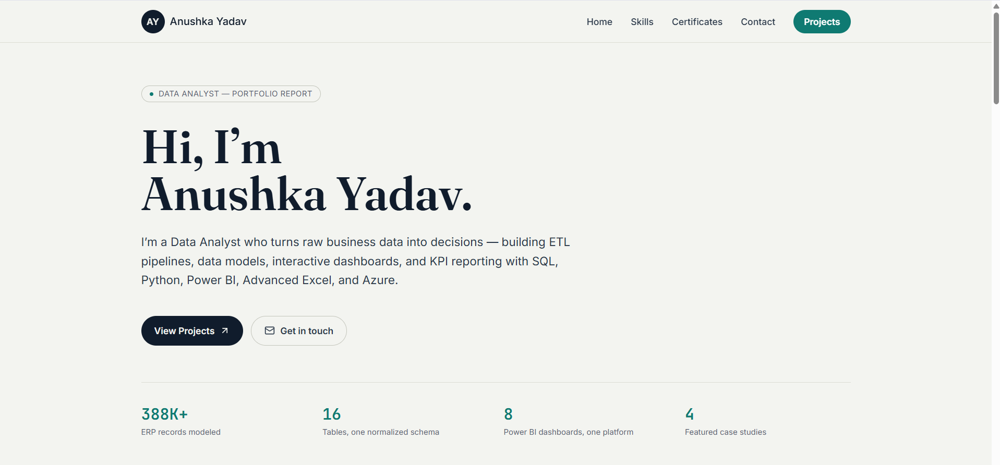
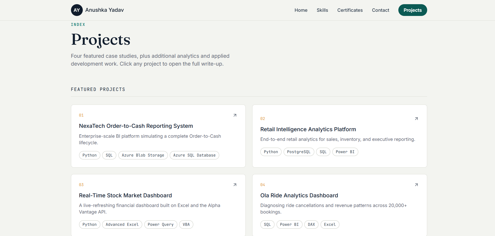
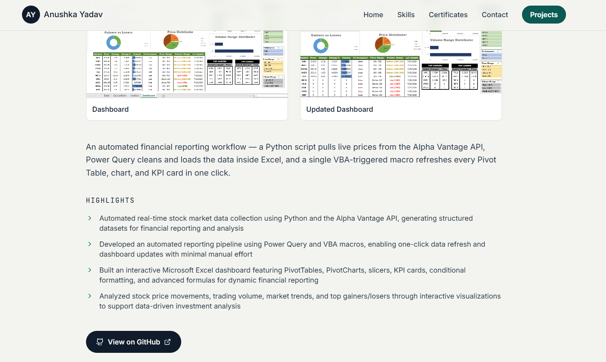

# 🌐 Anushka Yadav Portfolio

A modern and interactive Data Analytics portfolio built with **React** and **Vite** to showcase my projects, technical skills, certifications, and professional experience.

The portfolio is designed as a digital resume where recruiters can explore detailed project case studies, dashboard screenshots, GitHub repositories, and my analytics journey.

---

## 🚀 Live Website

🔗 https://anushka-yadav-portfolio-delta.vercel.app/

---

# 📸 Portfolio Preview








---

# ✨ Features

- Responsive modern UI
- Interactive navigation
- Featured project case studies
- Dashboard screenshot gallery
- GitHub project integration
- Skills section
- Internship section
- Certificates section
- Contact section
- Mobile friendly
- Built with React + Vite

---

# 📊 Featured Projects

## 1. NexaTech Order-to-Cash Reporting System

Enterprise-scale Business Intelligence platform simulating a complete Order-to-Cash lifecycle.

### Technologies

- Python
- SQL
- Azure Blob Storage
- Azure SQL Database
- Power BI
- ETL

Highlights

- Generated 388,000+ ERP records
- Designed a 16-table relational ERP schema
- Built modular ETL pipelines
- Developed 8 interactive Power BI dashboards
- Integrated Azure Blob Storage
- Built executive reporting dashboards

---

## 2. Retail Intelligence Analytics Platform

Retail analytics solution for sales, inventory, customer behavior, and executive reporting.

Technologies

- Python
- PostgreSQL
- SQL
- Power BI
- Grafana
- Docker

Highlights

- ETL Pipeline
- Star Schema
- SQL Analytics
- Customer Segmentation
- Executive Dashboard
- Inventory Analytics

---

## 3. Real-Time Stock Market Dashboard

Live financial dashboard powered by Alpha Vantage API.

Technologies

- Python
- Excel
- Power Query
- VBA
- API Integration

Highlights

- Real-time stock prices
- Automated refresh
- Pivot Tables
- Interactive charts
- Financial KPIs

---

## 4. Ola Ride Analytics Dashboard

Business Intelligence dashboard analyzing ride-booking performance.

Technologies

- SQL
- Power BI
- DAX
- Excel

Highlights

- Ride cancellations
- Revenue analysis
- Payment insights
- Vehicle performance
- Customer ratings

---

# 📈 Other Analytics Projects

- Mobile Sales Analysis Dashboard
- Customer Shopping Behaviour Analysis
- Call Center Performance Dashboard

---

# 💻 Other Software Projects

- Hospital Management System
- Employee Management System
- AI Chatbot
- Netflix Clone
- Product Website
- Expense Tracker

---

# 🛠 Tech Stack

## Languages

- Python
- SQL
- JavaScript

## Data Analytics

- Power BI
- Excel
- DAX
- ETL
- Data Warehousing
- Data Modeling

## Databases

- PostgreSQL
- SQL Server
- Azure SQL Database

## Cloud

- Azure Blob Storage

## Libraries

- Pandas
- NumPy
- Faker
- SQLAlchemy

## Development

- React
- Vite
- Tailwind CSS
- Git
- GitHub

---

# 📂 Project Structure

```
public/
│
├── images/
│   ├── nexatech/
│   ├── retail/
│   ├── real_time/
│   ├── ola/
│   └── portfolio/
│
src/
│
├── App.jsx
├── main.jsx
└── index.css

package.json
vite.config.js
README.md
```

---

# ⚙ Installation

Clone the repository

```bash
git clone https://github.com/anusshkaydv/anushka-portfolio.git
```

Go into the project

```bash
cd anushka-portfolio
```

Install dependencies

```bash
npm install
```

Run locally

```bash
npm run dev
```

Production build

```bash
npm run build
```

---

# 📬 Contact

**Anushka Yadav**

📧 Email

anushka51203@gmail.com

💼 LinkedIn

https://www.linkedin.com/in/anushka-yadav-6154492b8

💻 GitHub

https://github.com/anusshkaydv

---

## ⭐ If you like this project

Feel free to star the repository and explore my other Data Analytics projects.
